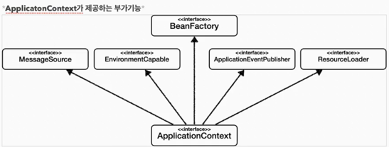
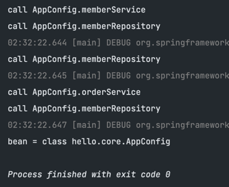

<div align="center">
  <h1>TIL</h1>
</div>

###  2022/12/30

#### 회원 도메인 실행과 테스트
현재 까지의 작업물은 순수 자바로 개발을 한 상태이다.

- 문제점
  - 저장소를 어떤 것을 사용할 지 아직 확정이 안된 상태이다. 따라서 MemberRepository 인터페이스의 구현체를 사용하여 값을 저장한다.<br/>하지만 그 구현체를 생성해줄 뭔가가 없기 때문에 MemberServiceImpl에서 의존관계를 갖게된다.<br/>이는 추후 저장소가 변경된다면 코드 수정이 불가피하므로 OCP, DIP에 위배되는 상황이다.

#### 주문과 할인 도메인 설계
- 주문과 할인 정책
  - 회원은 상품을 주문할 수 있다.
  - 회원 등급에 따라 할인 정책을 적용할 수 있다.
  - 할인 정책은 모든 VIP는 1000원을 할인해주는 고정 금액 할인을 적용해달라.
  - 할인 정책은 변경 가능성이 높다. 회사의 기본 할인 정책을 아직 정하지 못했고, 오픈 직전까지 고민을 미루고 싶다. 최악의 경우 할인을 적용하지 않을 수도 있다.

### 2022/12/31

#### 새로운 할인 정책 개발
- discountPolicy 인터페이스의 구현체를 통해 정책 변경이 가능하다.
  - 하지만 현재 OrderServiceImpl은 추상화된 인터페이스와 구현체에 모두 의존성을 갖고 있다.
  - 따라서 할인 정책을 변경할 때 마다 코드 변경이 발생한다 -> OCP, DIP 위배

#### 해결책: 관심사 분리
- 현재 위와 같은 문제가 발생하는 원인은 OrderServiceImpl에서 SRP를 위배하고 있기 때문이다.
  - 현재 필요한 조치는 관심사를 분리시키는 작업이 필요하다.
  - 즉 OrderServiceImpl 객체는 어떤 할인 정책 구현체를 사용하는지 알 필요가 없도록 만들어야 한다.

- AppConfig 객체를 통해 외부에서 필요한 구현 객체를 주입하도록 한다.
  - 따라서 MemberServiceImpl은 인터페이스에만 의존하고 실제 구현 객체를 어떤걸 사용하는지에 대해서는 전혀 알 필요가 없어지고 외부에서 주입받는 객체를 사용하게 된다.
  - DIP가 완성된 순간이다.
  - 객체를 생성하고 연결하는 역할과 실행하는 역할이 명확히 분리되었다. -> 관심사의 분리
  - 공연 기획자라고 생각하자. 배역에 맞는 담당 배우를 선택하는 역할이다.
  - 각 배우들은 담당 기능을 '실행'하는 책임만 지면 된다.

- 새로운 구조와 할인 정책 적용
  - AppConfig의 등장으로 애플리케이션이 크게 '사용 영역'과 객체를 생성하고 '구성(Configuration)하는 영역'으로 분리되었다.
  - 할인 정책을 변경하더라도 AppConfig 내부의 구성 영역만 변경하면 된다.

#### 제어의 역전(IoC)
- 프로그램의 제어 흐름을 직접 제러하는 것이 아니라 외부에서 관리하는 것이다.

#### 의존관계 주입(DI)
- 인터페이스에 의존하도록 작성하여 실제 어떤 구현 객체가 사용될지는 모르도록 하는 것이다.
- '정적인 클래스 의존관계' & '실행 시점에 결정되는 동적인 객체 의존관계'
  - 정적인 클래스 의존관계
    - 클래스가 사용하는 import문만 보고서 의존관계를 판단할 수 있다.
    - 애플리케이션을 실행하지 않아도 분석이 가능하다.
    - 하지만 이런 의존관계 만으로는 실제로 어떤 구현 객체가 주입될 지는 알 수 없다.
  - 동적인 객체 의존관계
    - 애플리케이션 실행시점에 외부에서 실제 구현 객체를 생성하고 클라이언트에 전달해서 의존관계가 연결되는 것을 의미한다.
    - 따라서 클라이언트 코드를 변경하지 않고, 클라이언트가 호출하는 대상의 타입 인스턴스를 변경할 수 있다.
    - 정적인 클래스 의존관계를 변경하지 않고, 동적인 객체 인스턴스 의존관계를 쉽게 변경할 수 있다.
    - 정적인 클래스 의존관계를 변경하지 않고 === 클라이언트 코드를 수정하지 않고

#### IoC 컨테이너 & DI 컨테이너
- AppConfig처럼 객체를 생성하고 관리하면서 의존관계를 연결해 주는 것을 의미
  - 의존관계 주입에 초점을 맞추어 주로 DI 컨테이너라고 부른다.
  - 어샘블러, 오브젝트 팩토리 등으로 불리기도 한다.

#### 스프링 컨테이너
- ApplicationContext를 스프링 컨테이너라고 한다.
- 기존에는 개발자가 AppConfig를 사용해서 직접 객체를 생성하고 DI를 했지만, 이제는 스프링 컨테이너를 통해 사용한다.
- Bean 어노테이션이 붙은 모든 메서드를 호출해서 객체를 등록한다.
- getBean() 메서드를 통해 등록된 객체를 가져올 수 있다.
- 지금부터는 스프링 컨테이너에 객체를 스프링 빈으로 등록하고, 스프링 컨테이너에서 스프링 빈을 찾아서 사용하도록 변경되었다.

#### 스프링 컨테이너 생성
- 스프링 컨테이너 생성
  - 컨테이너를 생성하면 스프링 빈 저장소에 빈 이름, 빈 객체를 저장하게 된다.
- 스프링 빈 등록
  - Bean 어노테이션이 달려있는 메서드 명을 빈 이름, 반환되는 객체를 빈 객체로 저장하게 된다.
  - Bean 이름은 직접 부여도 가능하다. 하지만 중복되는 이름으로 설정하면 오류가 발생할 수 있으니 조심해야 한다.
- 스프링 빈 의존관계 설정 -준비-
  - 설정 정보를 작성
- 스프링 빈 의존관계 설정 -완료-
  - 컨테이너는 설정 정보를 참고해서 의존관계를 주입한다.
  - 이때 스프링은 빈을 생성하고 의존관계를 주입하는 단계가 나누어져 있다.

#### 스프링 빈 조회 - 상속관계
- 부모 타입으로 조회하면 자식 타입도 함께 조회한다.
- 따라서 최고 부모인 Object 타입으로 조회하면 모든 스프링 빈을 조회할 수 있다.

### ApplicationContext에서 빈을 조회하는 일은 거의 없겠지만 '자동 의존관계 주입'에 대해서 공부할 때 도움이 되므로 알아는 두어야 하는 지식이다.

#### BeanFactory와 ApplicationContext

- BeanFactory 
  - 스프링 컨테이너의 최상위 인터페이스
  - 스프링 빈을 관리하고 조회하는 역할을 담당한다.
  - 우리가 지금까지 사용한 대부분의 기능은 모두 BeanFactory가 제공해주는 기능들이다.
- ApplicationContext
  - BeanFactory 기능을 모두 상속받아서 제공한다.
  - 그럼 둘의 차이는 무엇인가?
    - 애플리케이션을 개발할 때는 빈 관리 및 조회 외의 많은 부가 기능이 필요하다.
    
- ApplicationContext가 제공하는 부가기능
  - 메시지 소스를 활용한 국제화 기능
  - 환경변수
    - 로컬, 개발, 운영 등을 구분해서 처리
  - 애플리케이션 이벤트
  - 편리한 리소스 조회

#### 다양한 설정 혁식 지원 - 자바 코드, XML
- 스프링 컨테이너는 다양한 형식의 설정 정보를 받아드릴 수 있게 유연하게 설계되어 있다.
  - 자바 코드, XML, Groovy 등등
- 어노테이션 기반 자바 코드 설정 사용
  - 지금까지 사용해온 내용이다.
- XML 설정 사용
  - 최근에는 스프링 부트를 사용하게 되면서 잘 사용하지 않는다.
  - 하지만 XML을 사용하면 컴파일 없이 빈 설정 정보를 변경할 수 있다는 장점도 있긴 하므로 배워두긴 해야 한다.
- XML 기반의 `appConfig.xml` 과 자바 코드로 된 `AppConfig.java`설정 정보를 비교해 보면 많이 유사하다는 것을 알 수 있다.

### 2023/1/3

#### 스프링 빈 설정 메타 정보 - BeanDefinition (나중에 다시 듣기 - 약간 어려움)

- `BeanDefinition`이라는 추상화가 존재
  - 쉽게 말해 역할과 구현을 개념적으로 나눈 것이라고 볼 수 있다.
  - 스프링 컨테이너는 자바 코드인지, XML인지 몰라도 되고 BeanDefinition만 알면 된다.
  - `BeanDefinition`을 빈 설정 메타정보라고 한다.
  - 즉 **스프링 빈은 `BeanDefinition`라는 객체로 설정 정보를 추상화 한다** 라는 것을 기억하자! 

#### 스프링 빈을 등록하는 방법 두 가지
1. 직접 등록하기
2. 팩토리 빈을 통해 등록하기(일반적인 방법)

#### 웹 애플리케이션과 싱글톤
- 스프링은 태생이 기업용 온라인 서비스 기술을 지원하기 위해 탄생하였다. 또한 대부분의 스프링 애플리케이션은 웹 애플리케이션이다.
- 따라서 고객의 요청은 계속 들어온다.
  - 그렇다면 매 번 DI 컨테이너는 Service객체를 생성해서 반환하게 된다 -> 문제가 되는 부분!
  - 이것은 메모리 낭비가 심하다. -> 싱글톤 패턴을 적용시키면 효율적으로 개선할 수 있다.
- 하지만 DI 컨테이너를 사용하면 객체를 알아서 싱글톤으로 관리해준다.
  - 이미 만들어진 객체를 공유해서 효율적으로 사용할 수 있다. 하지만 여러가지 문제점이 존재한다.
  1. 싱글톤 패턴 적용을 위한 코드 자체가 많이 들어간다.
  2. 클라이언트가 구체 클래스에 의존하므로 DIP에 위배된다. 또한 OCP 위배 가능성이 높다.
  3. 테스트하기가 어렵다.
  4. private 생성자로 자식 클래스를 만들기 어렵다.
  5. 따라서 유연성이 떨어지고 안티패턴으로 불리기도 한다.

#### 싱글톤 컨테이너
- 스프링 컨테이너는 싱글톤 패턴을 적용하지 않아도, 객체 인스턴스를 싱글톤으로 관리한다.
- 스프링 컨테이너의 이런 기능으로 싱글톤 패턴의 모든 단점을 해결해준다.
- 이렇게 싱글톤 객체를 생성하고 관리하는 기능을 `싱글톤 레지스트리`라고 한다.

#### 싱글톤 방식의 주의점
- 싱글톤 방식은 여러 클라이언트가 하나의 같은 객체를 공유하기 때문에 상태를 유지하게 설계하면 안된다.
- 무상태로 설계해야 한다.
  - 특정 클라이언트에 의존적인 필드가 있으면 안된다.
  - 특정 클라이언트가 값을 변경할 수 있는 필드가 있으면 안된다.
  - 가급적 읽기만 가능해야 한다.
  - 필드 대신, 자바에서 공유되지 않는 지역변수, 파라미터, ThreadLocal 등을 사용해야 한다.

#### @Configuraion의 역할
- AppConfig 파일을 살펴보면 각 서비스 빈을 등록하는 과정에서 여러 개의 memberReposiopry 객체를 생성하는 것처럼 보인다.
- 하지만 실제 결과는 하나의 객체를 사용한다고 나온다.
```java
    @Test
    void configurationDeep() {
        ApplicationContext ac = new AnnotationConfigApplicationContext(AppConfig.class);
        AppConfig bean = ac.getBean(AppConfig.class);

        System.out.println("bean = " + bean.getClass());  // $$EnhancerBySpringCGLIB$$ad8aea39 가 클래스명 뒤에 추가적으로 출력된다.
    }
```
- 이 코드의 결과로는 class hello.core.AppConfig 가 출력되어야 하는데 실제로는 아래와 같은 결과가 나온다.
- `bean = class hello.core.AppConfig$$EnhancerBySpringCGLIB$$ad8aea39`
- 이것은 스프링이 `CGLIB`이라는 바이트 코드 조작 라이브러리를 사용해서 AppConfig 클래스를 상속받은 임의의 다른 클래스를 만들고, 그 클래스를 스프링 빈으로 등록한다.

- AppConfig@GCLIB 예상 코드

  - 실제로 GCLIB의 내부 기술을 사용하는 것은 매우 어렵다.
  - 또한 AppConfig@GCLIB은 APppConfig를 상속받기 때문에 조회가 가능한 것이다.
- 만약 @Configuration 어노테이션을 쓰지 않는다면 어떻게 될까?

  - 싱글톤이 보장되지 않는 것을 볼 수 있다.
- 따라서 고민하지 말고 스프링 설정 정보는 항상 `@Configuration`을 사용하자.

#### 컴포넌트 스캔과 의존관계 자동 주입 시작하기
- 지금까지는 스프링 빈을 등록할 때 어노테이나 XML에서 빈을 직접 등록하여 빈을 사용했다.
- 컴포넌트 스캔을 사용하려면 먼저 `@ComponentScan`을 설정 정보에 붙여주면 된다.
- 가존의 AppConfig와 다르게 @Bean으로 등록한 클래스가 아예 없다.
  - 주의 할 점은 @Configuration이 붙어있으면 해당 설정 정보도 자동으로 등록되기 때문에 앞서 만들어둔 AppConfig, TestConfig 등에서 사용한 설정 정보도 함께 등록되므로 제외시켜줘야 한다.
- @Component 어노테이션이 붙은 클래스를 스캔해서 스프링 빈으로 등록해준다.
- 이전에는 @Bean으로 직접 설정 정보를 작성했고, 의존관계도 직접 명시했다. 이제는 이런 설정 정보 자체가 없기 때문에 의존관계 주입도 해당 클래스 내부에서 모두 해결해야 한다.
- 이를 @Autowired 어노테이션을 통해 설정하는 것이다.
- 컴포넌트 스캔을 통해 스프링 빈이 등록되면 클래스명에서 첫글자만 소문자로 변경된 이름으로 등록된다.
  - 만약 빈 이름을 직접 등록하고 싶으면 `@Component("지정할 이름")`으로 설정하면 된다.
- 의존관계같은 경우, 주입 받아야 하는 객체의 타입과 동일한 빈을 찾아서 주입시켜 준다.
  - 또한 생성자에 파라미터가 많더라도 알아서 찾아서 주입시켜 준다.

#### 탐색 위치와 기본 스캔 대상
- 모든 자바 클래스를 모두 컴포넌트 스캔을 진행하면 시간이 오래 걸린다.
- 따라서 특정 위치부처 탐색하도록 시작 위치를 지정할 수 있다.
- `beanPackages`
  - 시작 위치 지정
  - 여러개 중복 지정 가능
- `beanPackageClasses`
  - 지정한 클래스의 패키지를 탐색 시작 위로 지정한다.
- 권장하는 방법
  - 패키지 위치를 따로 지정하지 않고, 설정 정보 클래스의 위치를 프로젝트 최상단에 두는 것이다.

#### 컴포넌트 스캔 기본 대상
- 컴포넌트 스캔은 @Component 뿐만 아니라 아래 내용들도 추가적으로 대상으로 삼는다.
  - @Component
  - @Controller
  - @Service
  - @Repository
  - @Configuration
- 게다가 위와 같은 어노테이션이 있으면 스프링은 부가 기능을 수행한다.
  - @Controller : 스프링 MVC 컨트롤러로 인식
  - @Service : 특별한 처리를 하지는 않는다. 대신 개발자들이 '핵심 비즈니스 로직이 여기에 있겠구나'라고 인식하는데 도움을 준다.
  - @Repository : 스프링 데이터 접근 계층으로 인식하고, 데이터 계층의 예외를 스프링 예외로 변환해준다.
  - @Configuration : 스프링 설정 정보로 인식하고, 스프링 빈이 싱글톤을 유지하도록 추가 처리르 한다.

#### 중복 등록과 충돌
- 자동 빈 등록 vs 자동 빈 등록
  - `ConflictingBeanDefinitionException`예외가 발생한다.
- 수동 빈 등록 vs 자동 빈 등록
  - 이 경우 수동 등록 빈이 우선권을 가진다.(수동 빈이 자동 빈을 오버라이딩 해준다.)
  - 하지만 이런식으로 수동 등록한 빈 때문에 에러가 발생하고 발견하기 어렵다는 점이 존재한다.
  - 따라서 스프링 부트는 기본으로 스프링 빈 오버라이딩을 제한시켰다.
  - **지양해야 한다! 애매한 상황을 애초에 만들지 않는것이 좋다.**
  
#### 의존관계 자동 주입
- 의존관계 주입은 4가지가 존재한다.
  1. 생성자 주입
  2. setter 주입
  3. 필드 주입
  4. 일반 메서드 주입
- 생성자 주입
  - @Autowired로 지금까지 해오던 방법
  - 생성자 호출 시점에 딱 1번만 호출되는 것이 보장된다.
  - **불변, 필수** 의존관계에 사용
  - 생성자가 단 한개라면 @Autowired 어노테이션 생략 가능
- 수정자 주입
  - setter로 의존관계를 주입
  - **선택, 변경** 가능성이 존재하는 의존관계 주입에 사용하면 된다.
- 필드 주입
  - 필드 앞에 @Autowired 어노테이션만 붙이면 주입이 된다. -> 생성자를 따로 작성할 필요가 없는 것이다.
  - 하지만 이는 안티 패턴이다.
    - 외부에서 변경이 불가능하다.
- 일반 메서드 주입
  - 그냥 함수로 매개변수를 입력받고 의존관계 주입받는 방법
  - 생성자 주입하고 거의 똑같다.
  - 하지만 잘 사용하지 않는다.
  - 
#### 옵션 처리
- 주입할 스프링 빈이 없어도 동작해야 할 때가 있다.
- 이때 @Autowired만 사용하면 디폴트 값때문에 자동 주입 대상이 없으면 오류가 발생한다.
- @Autowired(required=false) : 자동 주입할 대상이 없으면 수정자 메소드 자체가 호출 안됨
- org.springframework.lang.@Nullable : 자동 주입할 대상이 없으면 null이 입력된다.
- Optional<> : 자동 주입할 대상이 없으면 Optional.empty가 입력된다.

#### 생성자 주입을 선택하라
- **불변**
  - 대부분의 의존관계 주입은 한번 일어나면 애플리케이션 종료시점까지 의존관계를 변경할 일이 없다.
  - 만약 수정자 주입 방법을 사용한다면 setter 함수를 pulbic으로 해야 하므로 생성자 변경이 일어날 수도 있다.
- **누락**
  - 프에임워크 없이 순수한 자바 코드를 단위 테스트하는 경우 가짜 객체를 주입받아서 사용을 한다.
- **final 키워드**
  - 생성자 주입을 사용하면 필드에 final 키워드를 사용할 수 있다.
  - 따라서 생성자에서 혹시라도 값이 설정되지 않은 오류를 컴파일 시점에 막아준다.
  - *컴파일 오류는 세상에서 가장 빠르고, 좋은 오류다!*
- 정리
  - 생성자 주입 방식을 선택하느 이유는 여러가지가 있지만, 프레임워크에 의존하지 않고, 순수 자바 언어의 특징을 잘 살리는 방법이기도 하다.
  - 기본으로 생성자 주입을 사용하고, 필수 값이 아닌 경우에는 수정자 주입 방식을 옵션으로 부여하면 된다. 생성자 주입과 수정자 주입을 동시에 사용할 수 있다.
  - **항상 생성자 주입을 선택해라! 그리고 가끔 옵션이 필요하면 수정자 주입을 선택해라. 필드 주입은 지양하는 편이 좋다**

#### 조회 빈이 2개 이상
- 상위 타입이 같은 하위 타입 두개를 스프링 빈으로 동시에 등록하면 에러가 발생한다.
- 하위 타입으로 빈을 지정하는 것은 DIP를 위배하고 유연성이 떨어진다.
- 또한 이름만 다르고 완전히 똑같은 타입의 스프링 빈이 2개 있을 때도 해결이 안된다.

#### 위의 문제를 해결하는 방법
1. @Autowired 필드 명 매칭
   - 타입 매칭을 시도하고, 이때 여러 빈이 있으면 필드 이름, 파라미터 이름으로 빈 이름을 추가 매칭한다.\
   - 동작 정리
     1. 타입 매칭
     2. 타입 매칭의 결과가 2개 이상일 때 필드 명, 파리머터 명으로 빈 이름 매칭
2. @Qualifier
   - 추가 구분자를 붙여주는 방법
   - 주입 시 추가적인 방법을 제공하는 것이지 빈 이름을 변경하는 것은 아니다.
   - 만약 @Qualifier로 지정한 이름을 차지 못한다면?
     - 해당 이름의 스프링 빈을 추가로 찾는다.
3. @Primary
   -우선순위를 정하는 방법
- 우선 순위
  - @Primary는 기본처럼 동작하는 것이고, @Qualifier는 매우 상세하게 동작한다.
  - 스프링은 자동보다는 수동이, 넓은 범위의 선택권 보다는 좁은 범ㅇ위의 선택권이 우선 순위가 높다. 따라서 @Qualifier가 우선권이 높다.

#### 조회한 빈이 모두 필요할 때, List, Map

- 동적으로 빈을 선택해서 테스트 할 때, 다형성을 유지하면서 매우 편리하게 활용이 가능하다.
- **꼭 기억하자!**

#### 자동, 수동의 올바른 실무 운영 기준
- 개발자 입장에서 수동으로 빈을 등록하다 보면 관리할 빈이 많고 설정 정보가 커지면서 관리하는 것 자체가 부담이 될 수 있다.
- 그렇다면 수동 빈 등록은 언제 사용하면 좋을 까?
  - 애플리케이션은 크게 업무 로직과 기술 지원 로직으로 나눌 수 있다.
- 업무 로직 빈
  - 웹을 지원하는 컨트롤러, 핵심 비즈니스 로직이 있는 서비스, 데이터 계층의 로직을 처리하는 리포지토리 등
- 기술 지원 로직
  - 기술적인 문제, 공통 관심사(AOP)를 처리할 때 주로 사용
- 기술 지원 로직은 보통 애플리케이션 전반에 걸쳐서 광범위하게 영향을 미친다.

#### 빈 생명주기 콜백
- 스프링 빈은 다음과 같은 라이프 사이클을 가진다.
  - 객체 생성 -> 의존관계 주입
- 위 과정이 다 끝난 다음에야 필요한 데이터를 사용할 수 있는 준비가 완료된다.
- 그렇다면 개발자는 의존관계 주입이 모두 완료된 시점을 어떻게 알 수 있을까?
  - 스프링은 의존관계 주입이 완료되면 스프링 빈에게 콜백 메서드를 통해서 초기화 시점을 알려주는 기능을 제공한다.
  - 또한 스프링 컨테이너가 종료되기 깆건에 고멸 콜백을 준다.
- 스프링 빈의 이벤트 라이플 사이클
  - 스프링 컨테이너 생성 -> 스프링 빈 생성 -> 의존관계 주입 -> 초기화 콜백 -> 사용 -> 소멸전 콜백 -> 스프링 종료
  - 초기화 콜백: 빈이 생성되고, 빈의 의존관계 주입이 완료된 후 호출
  - 소멸전 콜백: 빈이 고멸되기 직전에 호출
- 참고
  - 객체의 생성과 초기화를 분리하자 -> SRP 원칙
  - 생성자 안에서 무거운 초기화 작업을 함께 작업 하는 것 보다는 객체를 생성하는 부분과 초기화 하는 부분을 명확하게 나누는 것이 유지보수 관점에서 좋다.
  - 간단한 값을 설정하는 정도는 크게 상관이 없다.

#### 인터페이스 InitializingBean, DisposableBean

- 초기화, 소멸 인터페이스 단점
  - 스프링 전용 인터페이스다. 따라서 해당 코드가 스프링 전용 인터페이스에 의존한다.
  - 초기화, 소멸 메서드 명이 수정 불가능하다.
  - 내가 코드를 고칠 수 없는 외부 라이브러리에 적용할 수 없다.
  - 하지만 지금은 더 나은 방법들이 존재해서 거의 사용하지 않는다.

#### 빈 등록 초기화, 소멸 메서드

- 설정 정보 사용 특징
  - 메서드 이름을 자유롭게 줄 수 있다.
  - 스프링 빈이 스프링에 의존하지 않는다.
  - 코드를 고칠 수 없는 외부 라이브러리에도 적용이 가능하다.
- 종료 메서드 추론
  - `@Bean`의 `destroyMethod` 속성에는 특별한 기능이 존재한다.
  - `destroyMethod`는 기본값이 `(inferred)`로 등록이 되어 있다.
  - 이 추론 기능은 `close`, `shutdown`이름을 갖는 메서드를 자동으로 호출해준다.
  - 따라서 직접 스프링 빈으로 등록하면 종료 메서드는 따로 적어주지 않아도 동작한다.

#### 애노테이션 @PostConstruct, @PreDestroy
- 최신 스프링에서 가장 권장하는 방법
- 어노테이션 하나만 붙이면 해결되므로 매우 편리하다.
- 컴포넌트 스캔과 잘 어울린다.
- 하지만 외부 라이브러리에는 적용하지 못한다. 따라서 그럴 경우에는 이전에 배운 `initMethod`, `destroyMethod`를 사용하자.

#### 빈 스코프
- 스프링이 지원하는 스코프
  1. 싱글톤: 스프링 컨테이너의 시작과 종료까지 유지되는 가장 넓은 범위의 스코프
  2. 프로토 타입: 빈의 생성과 의존관계 주입까지만 관여하고 더는 관리하지 않는 매우 짧은 범위의 스코프
  3. 웹 관련 스코프

#### 프로토타입 스코프
- 프로토타입 스코프를 스프링 컨테이너에 조회하면 항상 새로운 인스턴스를 생성해서 반환한다.
- 프로토 타입을 관리할 책임은 빈을 받은 클라이언트에 있다.
- ## 따라서 `@preDestroy` 같은 함수로 종료를 시킬 수 없다.##
- 종료 메소드가 호출되지 않는다. 따라서 클라이언트가 종료 메소드 호출을 직접 해줘야 한다.

#### 프로토타입 빈과 싱글톤 빈을 함께 사용할 시 문제점
- 싱글톤 빈이 프로토타입 빈을 생성 시점에 주입을 받는다면 프로토타입 빈이 싱글톤 빈과 함께 계속 유지되는 것이 문제점이다.
- 이것은 프로토타입 빈의 의도와는 다른 결과이다.

#### 프로토타입 빈과 싱글톤 빈을 함께 사용하기 해결법
- 가장 간단한 방법은 빈이 프로토타입을 사용할때 마다 컨테이너에 새롭게 요청하는 것이다.
- 직접 필요한 의존관계를 주입받지 않고 찾는 것을 `Dependency LookUp`이라고 한다.
- PrototypeBeanProvider를 사용하면 DL이 가능해진다. 이 객체는 스프링이 알아서 스프링 빈으로 등록을 해준다.
- ObjectFactory: 기능이 단순, 별도의 라이브러리 필요없음, 스프링에 의존적
- ObjectProvider: ObjectFactory의 상속을 받아 부가적인 기능이 추가된 것, 스프링에 의존적

#### JSR-330 Provider
- 자바 표준이고 기능이 단순하므로 단위테스트를 만들거나 mock 코드를 만들기는 훨씬 쉬워진다.
- 대신 별도의 라이브러리를 호출해서 사용해야 한다.
- 정리
  - 매번 사용할 때마다 의존관계 주입이 완료된 새로운 객체가 필요하면 프로토타입 빈을 사용한다.
  - 그러나 실무에서 거의 사용하지 않는다.
- 자바 표준인 JSR-330을 사용할 지, 아니면 스프링이 제공하는 ObjectProvider를 사용할 지 고민을 할 수 있다.
  - 스프링이 아닌 다른 컨테이너에서도 사용할 수 있어야 한다면 JSR-330 Provider를 사용해야 한다.

#### 웹 스코프
- 웹 환경에서만 동작
- 프로토타입과 다르게 스프링이 해당 스코프의 종료시점까지 관리한다. 따라서 종료 메소드가 호출된다.
- 웹 스코프의 종류
  - request: HTTP 요청 하나가 들어오고 나갈 때 까지 유지되는 스코프, 요청마다 별도의 빈 인스턴스가 생성되고 관리된다.
  - session: HTTP session과 동일한 생명주기를 가지는 스코프
  - application: 서블릿 컨텍스트와 동일한 생명주기를 가지는 스코프
  - websocket: 웹 소켓과 동일한 생명주기를 가지는 스코프

#### request 스코프 예제 개발
- UUID를 사용해서 HTTP 요청을 구분하자
- 테스트용 컨트롤러를 만들어서 서버를 실행했지만 서버 구동부터 실패한다.
- 그 이유는 MyLogger 빈은 request스코프라서 고객의 request가 들어온 순간부터 생명주기가 시작된다. 하지만 서버가 실행되는 시점에는 request가 없으므로 의존성 주입이 안된다.
- 이 문제를 ObjectProvider를 통해 해결할 수 있다.